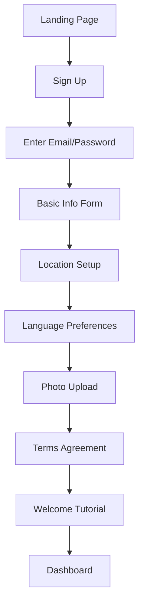
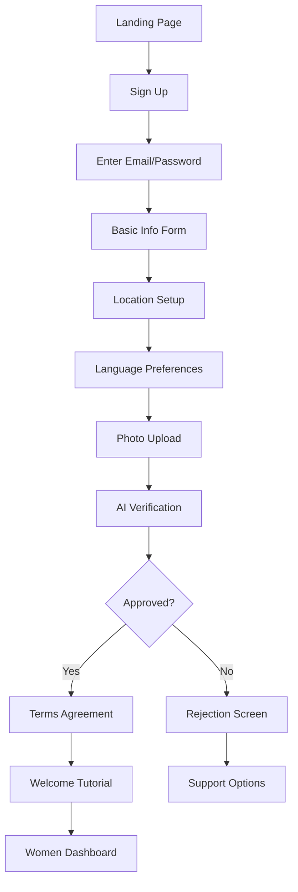
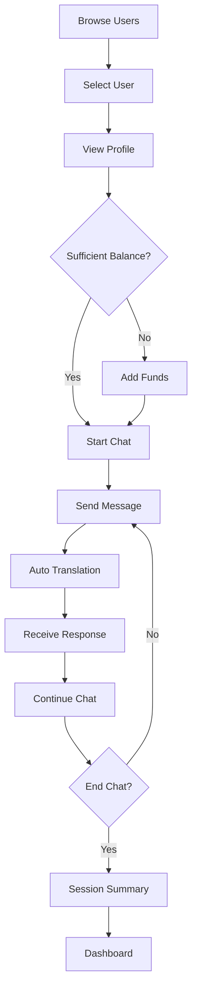
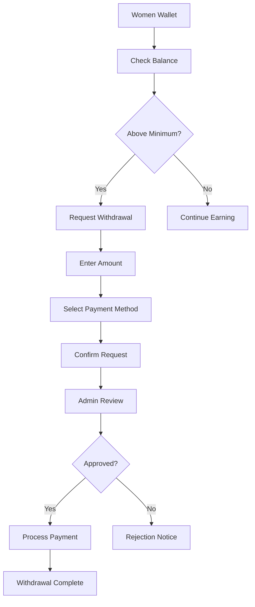

# Meow Chat - Requirements & Functionality Documentation

## Table of Contents
1. [Project Overview](#project-overview)
2. [User Types & Roles](#user-types--roles)
3. [Core Features](#core-features)
4. [User Flows](#user-flows)
5. [Business Logic](#business-logic)
6. [Technical Requirements](#technical-requirements)
7. [Security Requirements](#security-requirements)
8. [Performance Requirements](#performance-requirements)
9. [Internationalization](#internationalization)
10. [Mobile Support](#mobile-support)

---

## Project Overview

### Description
Meow Chat is a real-time chat platform connecting users across languages with automatic translation. The platform features a unique business model where male users pay for chat time while female users earn money for engaging in conversations.

### Target Audience
- **Men**: Users seeking conversation and connection
- **Women**: Users looking to earn income through chat engagement
- **Administrators**: Platform managers and moderators

### Key Value Propositions
1. **Real-time Translation**: Break language barriers with automatic message translation
2. **Earning Opportunity**: Women can earn money by chatting
3. **Safe Environment**: AI-powered moderation and verification
4. **Global Reach**: Support for 100+ languages

---

## User Types & Roles

### 1. Male Users (Customers)
**Description**: Primary paying customers who initiate and pay for chat sessions.

**Capabilities**:
- Browse and discover female profiles
- Initiate chat sessions
- Send messages and voice notes
- Send virtual gifts
- View transaction history
- Manage wallet and add funds

**Restrictions**:
- Must have sufficient wallet balance to chat
- Cannot access admin features
- Cannot earn money on the platform

### 2. Female Users (Earners)
**Description**: Verified users who earn money by engaging in chat conversations.

**Capabilities**:
- Receive chat requests
- Respond to messages
- Earn money per minute of chat
- Track earnings and performance
- Request withdrawals
- Manage shift schedules
- Receive virtual gifts

**Requirements**:
- Must complete profile verification
- Must pass AI approval process
- Must maintain performance standards
- Must adhere to scheduled shifts

**Restrictions**:
- Cannot initiate chats
- Cannot use platform as paying customer

### 3. Administrators
**Description**: Platform managers with elevated privileges.

**Admin Levels**:
| Role | Access Level | Capabilities |
|------|--------------|--------------|
| Super Admin | Full | All features + user management |
| Admin | High | User management, moderation, reports |
| Moderator | Medium | Content moderation, chat monitoring |

**Capabilities**:
- User management (approve, suspend, ban)
- Content moderation
- Chat monitoring
- Financial management
- System configuration
- Analytics and reporting
- Audit log access

---

## Core Features

### 1. User Authentication

#### 1.1 Registration Flow
```
Step 1: Email & Password
├── Email validation
├── Password strength check
└── Account creation

Step 2: Basic Information
├── Full name
├── Gender selection
├── Date of birth
└── Phone number (optional)

Step 3: Location Setup
├── Country selection
├── State/region selection
└── GPS location (optional)

Step 4: Language Preferences
├── Primary language
├── Preferred chat language
└── Additional languages

Step 5: Profile Photo
├── Photo upload
├── AI verification
└── Gender detection

Step 6: Terms Agreement
├── Terms of Service
├── Privacy Policy
├── GDPR/CCPA consent

Step 7: Verification (Women Only)
├── AI profile review
├── Photo verification
└── Approval status
```

#### 1.2 Login Flow
- Email/password authentication
- Session management
- Remember me functionality
- Password reset via email

### 2. Profile Management

#### 2.1 Profile Information
**Basic Fields**:
- Full name
- Age (calculated from DOB)
- Location (country, state)
- Bio (up to 500 characters)
- Profile photo

**Extended Fields**:
- Occupation
- Education level
- Marital status
- Height
- Body type
- Interests (tags)
- Life goals
- Lifestyle preferences

#### 2.2 Photo Gallery
- Up to 10 photos
- AI verification for appropriateness
- Primary photo selection
- Photo reordering

### 3. Chat System

#### 3.1 Chat Features
| Feature | Description |
|---------|-------------|
| Text Messages | Standard text messaging |
| Voice Messages | Record and send audio |
| Translation | Real-time message translation |
| Read Receipts | Message read indicators |
| Typing Indicator | Shows when user is typing |
| Message History | Persistent chat history |

#### 3.2 Chat Session Management
- Session creation when first message sent
- Real-time billing per minute
- Session end on inactivity (5 min)
- Manual session end option
- Session history and statistics

#### 3.3 Translation System
- Automatic language detection
- NLLB-200 translation engine
- Toggle for showing original text
- Support for 200+ languages

### 4. Matching System

#### 4.1 User Discovery
- Browse online users
- Filter by language preference
- Filter by country/region
- Random match option
- Quick connect feature

#### 4.2 Match Criteria
```typescript
interface MatchCriteria {
  languageMatch: boolean;     // Preferred languages match
  countryMatch: boolean;      // Same country (optional)
  availability: boolean;      // Woman is available
  balance: boolean;           // Man has sufficient balance
}
```

### 5. Wallet System

#### 5.1 Men's Wallet
**Features**:
- View balance
- Add funds (simulated)
- Transaction history
- Auto-deduction during chat

**Transaction Types**:
- `credit`: Adding funds
- `debit`: Chat charges
- `gift`: Sending gifts

#### 5.2 Women's Wallet
**Features**:
- View earnings
- Earnings breakdown
- Withdrawal requests
- Transaction history

**Earning Types**:
- Chat earnings (per minute)
- Gift earnings
- Bonus earnings

### 6. Shift Management (Women)

#### 6.1 Shift Features
- Start/end shift
- View scheduled shifts
- Track shift earnings
- Performance metrics

#### 6.2 Shift Requirements
```typescript
interface ShiftRequirements {
  minHoursPerWeek: 20;        // Minimum weekly hours
  maxConsecutiveHours: 8;     // Maximum consecutive hours
  breakRequirements: true;    // Mandatory breaks
  performanceThreshold: 70;   // Minimum performance score
}
```

### 7. Gift System

#### 7.1 Virtual Gifts
Users can send virtual gifts with real monetary value.

**Gift Categories**:
- Flowers
- Hearts
- Luxury items
- Special occasion

**Gift Flow**:
1. Man selects gift
2. Balance deducted
3. Gift sent to woman
4. Woman receives notification
5. Earnings credited to woman

### 8. Video Calling

#### 8.1 Video Call Features
- 1-on-1 video calls
- Call initiation by men
- Accept/reject by women
- Per-minute billing
- Call quality settings

### 9. Moderation System

#### 9.1 Content Moderation
- AI-powered message scanning
- Keyword filtering
- Image moderation
- User reporting

#### 9.2 Violation Types
| Type | Severity | Action |
|------|----------|--------|
| Inappropriate language | Low | Warning |
| Harassment | Medium | Suspension |
| Sexual content | High | Ban |
| Fraud/Scam | Critical | Immediate ban |

### 10. Admin Dashboard

#### 10.1 Admin Features
- User management
- Content moderation
- Financial reports
- System settings
- Audit logs
- Performance monitoring
- Chat monitoring

---

## User Flows

### Flow 1: New User Registration (Male)



### Flow 2: New User Registration (Female)



### Flow 3: Chat Session



### Flow 4: Earning Withdrawal (Women)



---

## Business Logic

### 1. Chat Pricing

```typescript
interface ChatPricing {
  // Men's rates (what they pay)
  ratePerMinute: 0.50;        // USD per minute
  videoRatePerMinute: 1.00;   // USD per minute for video
  
  // Women's earnings (what they receive)
  earningRate: 0.35;          // 70% of rate
  videoEarningRate: 0.70;     // 70% of video rate
  
  // Minimum balance
  minBalance: 5.00;           // USD to start chat
  minWithdrawal: 50.00;       // USD minimum withdrawal
}
```

### 2. Billing Calculation

```typescript
function calculateChatCost(
  startTime: Date,
  endTime: Date,
  ratePerMinute: number
): number {
  // Calculate duration in minutes (rounded up)
  const durationMs = endTime.getTime() - startTime.getTime();
  const minutes = Math.ceil(durationMs / 60000);
  
  // Calculate total cost
  return minutes * ratePerMinute;
}

function calculateWomanEarning(
  chatCost: number,
  earningPercentage: number = 0.70
): number {
  return chatCost * earningPercentage;
}
```

### 3. Performance Scoring (Women)

```typescript
interface PerformanceMetrics {
  responseTime: number;      // Average response time in seconds
  messagesPerHour: number;   // Average messages per hour
  chatDuration: number;      // Average chat duration
  customerRating: number;    // Average rating (1-5)
  attendanceRate: number;    // Shift attendance percentage
}

function calculatePerformanceScore(metrics: PerformanceMetrics): number {
  let score = 0;
  
  // Response time (max 25 points)
  if (metrics.responseTime < 30) score += 25;
  else if (metrics.responseTime < 60) score += 20;
  else if (metrics.responseTime < 120) score += 15;
  else score += 5;
  
  // Messages per hour (max 25 points)
  score += Math.min(25, metrics.messagesPerHour * 2);
  
  // Chat duration (max 25 points)
  score += Math.min(25, metrics.chatDuration / 2);
  
  // Customer rating (max 25 points)
  score += metrics.customerRating * 5;
  
  // Attendance bonus (up to 10 extra points)
  if (metrics.attendanceRate > 95) score += 10;
  else if (metrics.attendanceRate > 90) score += 5;
  
  return Math.min(100, score);
}
```

### 4. AI Approval Logic

```typescript
interface ApprovalChecks {
  photoIsHuman: boolean;
  photoIsAppropriate: boolean;
  genderMatchesProfile: boolean;
  ageMatchesPhoto: boolean;
  profileComplete: boolean;
  noDuplicateAccount: boolean;
}

function evaluateApproval(checks: ApprovalChecks): ApprovalResult {
  // All checks must pass
  const allPassed = Object.values(checks).every(v => v === true);
  
  if (allPassed) {
    return { approved: true };
  }
  
  // Generate rejection reason
  const reasons = [];
  if (!checks.photoIsHuman) reasons.push('Photo does not appear to be a real person');
  if (!checks.photoIsAppropriate) reasons.push('Photo contains inappropriate content');
  if (!checks.genderMatchesProfile) reasons.push('Photo gender does not match profile');
  if (!checks.ageMatchesPhoto) reasons.push('Apparent age does not match profile');
  if (!checks.profileComplete) reasons.push('Profile is incomplete');
  if (!checks.noDuplicateAccount) reasons.push('Duplicate account detected');
  
  return {
    approved: false,
    reason: reasons.join('; ')
  };
}
```

---

## Technical Requirements

### Frontend
| Requirement | Specification |
|-------------|---------------|
| Framework | React 18+ |
| Language | TypeScript 5+ |
| Build Tool | Vite 5+ |
| Styling | Tailwind CSS 3+ |
| State Management | React Query + Context |
| Routing | React Router 6+ |
| UI Components | shadcn/ui |
| Forms | React Hook Form + Zod |
| Internationalization | i18next |

### Backend
| Requirement | Specification |
|-------------|---------------|
| Database | PostgreSQL 15+ |
| Auth | Supabase Auth |
| API | Supabase REST + Realtime |
| Functions | Supabase Edge Functions (Deno) |
| Storage | Supabase Storage |
| AI | Hugging Face Inference API |

### Browser Support
| Browser | Minimum Version |
|---------|-----------------|
| Chrome | 90+ |
| Firefox | 88+ |
| Safari | 14+ |
| Edge | 90+ |

---

## Security Requirements

### Authentication
- [x] Secure password hashing (bcrypt via Supabase)
- [x] JWT token-based authentication
- [x] Session management
- [x] Password reset via email
- [x] Rate limiting on auth endpoints

### Data Protection
- [x] Row Level Security (RLS) on all tables
- [x] User data isolation
- [x] Encrypted data transmission (HTTPS)
- [x] Secure file storage

### Privacy Compliance
- [x] GDPR consent collection
- [x] CCPA compliance
- [x] Data retention policies
- [x] User data export capability
- [x] Account deletion capability

### Content Security
- [x] AI content moderation
- [x] User reporting system
- [x] Admin moderation tools
- [x] Audit logging

---

## Performance Requirements

### Response Times
| Operation | Target | Maximum |
|-----------|--------|---------|
| Page load | < 2s | < 4s |
| API response | < 200ms | < 500ms |
| Message send | < 100ms | < 300ms |
| Translation | < 500ms | < 1s |
| Photo upload | < 3s | < 10s |

### Scalability
| Metric | Capacity |
|--------|----------|
| Concurrent users | 10,000+ |
| Messages per second | 1,000+ |
| Database connections | 500+ |
| File storage | 1TB+ |

### Availability
- Target uptime: 99.9%
- Planned maintenance windows: Off-peak hours
- Disaster recovery: Daily backups

---

## Internationalization

### Supported Languages (UI)
- English (en) - Default
- Spanish (es)
- French (fr)
- Hindi (hi)
- Arabic (ar)
- Chinese (zh)
- Bengali (bn)
- Portuguese (pt)
- Russian (ru)
- Japanese (ja)
- German (de)
- And 100+ more via NLLB-200

### RTL Support
- Arabic
- Hebrew
- Persian
- Urdu

### Locale Features
- Date/time formatting
- Number formatting
- Currency display
- Text direction

---

## Mobile Support

### Responsive Design
- Mobile-first approach
- Breakpoints: sm (640px), md (768px), lg (1024px), xl (1280px)
- Touch-optimized interactions

### Native Apps (Capacitor)
- iOS support (iOS 14+)
- Android support (Android 8+)
- Push notifications
- Camera access
- Microphone access

### Progressive Web App
- Offline capability (limited)
- Install prompt
- App-like experience

---

## Appendix A: Database Schema Overview

### Core Tables
```
profiles
├── id (PK)
├── user_id (FK -> auth.users)
├── full_name
├── gender
├── age
├── country
├── state
├── photo_url
├── bio
├── primary_language
├── preferred_language
├── approval_status
├── account_status
└── ... (extended fields)

chat_messages
├── id (PK)
├── chat_id
├── sender_id (FK -> profiles)
├── receiver_id (FK -> profiles)
├── message
├── translated_message
├── is_read
├── flagged
└── created_at

active_chat_sessions
├── id (PK)
├── chat_id
├── man_user_id
├── woman_user_id
├── status
├── rate_per_minute
├── total_minutes
├── total_earned
└── timestamps

wallets
├── id (PK)
├── user_id (FK -> profiles)
├── balance
└── currency

wallet_transactions
├── id (PK)
├── wallet_id (FK -> wallets)
├── type
├── amount
├── description
└── status
```

---

## Appendix B: Environment Variables

### Required Variables
```bash
# Supabase
VITE_SUPABASE_URL=https://project.supabase.co
VITE_SUPABASE_PUBLISHABLE_KEY=your-anon-key

# Edge Functions (set in Supabase Dashboard)
SUPABASE_SERVICE_ROLE_KEY=your-service-role-key
SUPABASE_DB_URL=postgresql://...
HUGGING_FACE_ACCESS_TOKEN=your-hf-token
MAILJET_API_KEY=your-mailjet-key
MAILJET_SECRET_KEY=your-mailjet-secret
LOVABLE_API_KEY=your-lovable-key
```

---

## Appendix C: Glossary

| Term | Definition |
|------|------------|
| Chat Session | A billable conversation period between a man and woman |
| Shift | A scheduled work period for women users |
| Wallet | Virtual currency balance for a user |
| RLS | Row Level Security - database access control |
| Edge Function | Serverless function running on Supabase |
| NLLB-200 | Meta's No Language Left Behind translation model |
